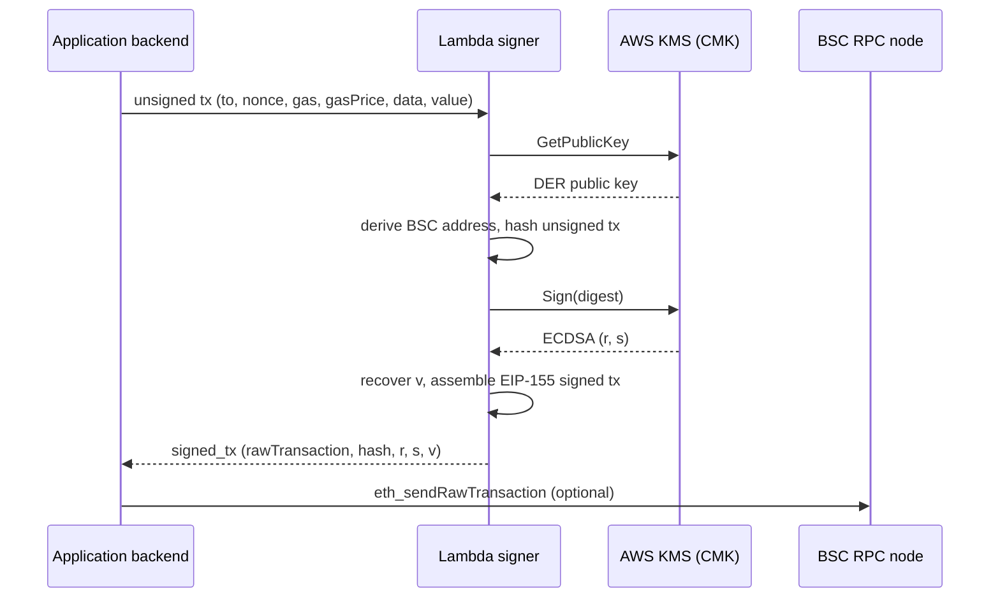

# AWS KMS Lambda Signer for BSC

> **Warning — demo infrastructure, not audited.**  
> This repository is reference code for learning and testnet experimentation. It has **not** undergone a security audit and is **not** production-hardened. Review IAM policies, logging, key rotation, monitoring, and threat modeling before any mainnet use.

AWS KMS/Lambda-based signing infrastructure adapted for **Binance Smart Chain (BSC)**, focused on **secure Web3 backend transaction workflows**.

The core goal: **avoid exposing raw private keys in application services**. Your backend builds unsigned transactions and delegates signing to an isolated Lambda function that calls **AWS KMS** (`ECC_SECG_P256K1`). The private key material never appears in environment variables, request payloads, or application memory on the backend.

Derived from [aws-samples/aws-kms-ethereum-accounts](https://github.com/aws-samples/aws-kms-ethereum-accounts). See [AWS-README.md](AWS-README.md) for the original Ethereum deep dive.

---

## Architecture



| Component | Responsibility |
|-----------|----------------|
| **Backend** | Business logic, nonce management, tx assembly — **no private keys** |
| **Lambda signer** | Hash unsigned tx, orchestrate KMS signing, apply EIP-155 `v` |
| **AWS KMS CMK** | Holds secp256k1 key pair; only `Sign` / `GetPublicKey` exposed to Lambda |
| **BSC RPC** | Broadcast signed raw transactions (testnet recommended for demos) |

---

## What changed for BSC

The upstream AWS sample targets Ethereum. This fork keeps the **KMS signing model** and adjusts chain-specific transaction parameters:

| Topic | Ethereum (typical) | BSC (this repo) |
|-------|-------------------|-----------------|
| **chainId** | `1` mainnet, `5` Goerli (historical), `11155111` Sepolia | `56` mainnet, `97` Chapel testnet |
| **Gas model** | Often EIP-1559 (`maxFeePerGas`, `maxPriorityFeePerGas`) on L1 | Legacy `gas` + `gasPrice` (PoSA chain) |
| **Tx assembly** | Type-2 fields for EIP-1559 txs | Legacy RLP encoding via `serializable_unsigned_transaction_from_dict` |
| **Address derivation** | Keccak-256 of KMS public key (same secp256k1 curve) | Identical — BSC uses the same account model as Ethereum |
| **Replay protection** | EIP-155: `v = recovery + chainId * 2 + 35` | Same formula with BSC `chainId` |

Configure the network at deploy time with `ETH_NETWORK` (`bsc`, `bsc-testnet`, `chapel`) or override with `CHAIN_ID`.

---

## Threat model

| Threat | Mitigation in this design | Residual risk |
|--------|---------------------------|---------------|
| Private key theft from backend | Backend never holds or transmits key material | Compromised backend can still **request arbitrary signatures** if it can invoke Lambda |
| Key exfiltration from Lambda | Key stays in KMS HSM; Lambda only receives signatures | Lambda code bugs or excessive IAM permissions could weaken isolation |
| Unauthorized signing | Restrict `lambda:InvokeFunction` and `kms:Sign` via IAM | Misconfigured resource policies are a common failure mode |
| Replay across chains | EIP-155 embeds `chainId` in signature | Wrong `CHAIN_ID` env var could produce valid but unintended-chain txs |
| Log leakage | Lambda logs event **keys** only; default `LOG_LEVEL=WARNING` | Raising log level or custom handlers may still leak payloads |
| Insider abuse | KMS CloudTrail + Lambda invocation auditing | Requires operational monitoring not included here |

---

## Security assumptions

1. **KMS is the sole custodian** of the signing key (`ECC_SECG_P256K1`, `SIGN_VERIFY`).
2. **Only the signer Lambda** has `kms:Sign` and `kms:GetPublicKey` on the CMK.
3. **Backend callers** are authenticated (IAM, API Gateway authorizer, VPC, etc.) — not fully implemented in this demo.
4. **Transaction intent** is validated off-chain before invocation (recipient, value, contract allowlists).
5. **Legacy gas transactions** (`gas` + `gasPrice`) are assumed; EIP-1559 type-2 txs are out of scope.
6. **BSC PoSA consensus** and RPC endpoints are trusted for broadcasting only; signing does not depend on RPC.
7. Operators accept **demo-grade** error handling, observability, and key lifecycle practices.

---

## Deploy (AWS CDK)

Prerequisites: AWS account, CDK CLI, Python 3.9+, Node.js.

```bash
python3 -m venv .venv && source .venv/bin/activate
pip install -r requirements.txt
cdk bootstrap   # once per account/region
cdk deploy
```

CDK provisions:

- KMS CMK (`ECC_SECG_P256K1`)
- Python 3.9 Lambda with `KMS_KEY_ID` and `ETH_NETWORK` environment variables
- IAM grants: Lambda → `kms:GetPublicKey`, `kms:Sign`

Destroy when finished:

```bash
cdk destroy
```

For testnet demos, deploy with Chapel:

```python
# app.py — pass eth_network when instantiating the stack
AwsKmsLambdaEthereumStack(app, "aws-kms-lambda-ethereum", eth_network="bsc-testnet")
```

---

## Local demo / testnet only

**Use BSC Chapel testnet (`chainId` 97) for all local and CI experiments.**

1. Deploy the stack (prefer `eth_network="bsc-testnet"`).
2. Read the KMS-derived address from Lambda logs or by invoking with a dry-run helper.
3. Fund the address via a [Chapel faucet](https://testnet.bnbchain.org/faucet-smart).
4. Copy [`.env.example`](.env.example) → `.env` and set `AWS_LAMBDA_FUNCTION_NAME` and `AWS_REGION`.
5. Run the example client:

```bash
pip install -r requirements-dev.txt
python examples/lambda_signer_client.py
```

6. Broadcast `signed_tx.rawTransaction` with `eth_sendRawTransaction` against a Chapel RPC (`BSC_RPC_URL` in `.env.example`).

**Do not** use this setup for mainnet funds without a full security review.

---

## Backend integration (secure client)

The backend sends **only unsigned transaction fields**. Never include `privateKey`, mnemonics, or seeds.

```python
import boto3, json, os

client = boto3.client("lambda", region_name=os.getenv("AWS_REGION"))
payload = {
    "to": "0x742d35Cc6634C0532925a3b844Bc9e7595f0bEb0",
    "nonce": 0,
    "gas": 21000,
    "gasPrice": 10_000_000_000,
    "value": 0,
    "data": "0x",
}

response = client.invoke(
    FunctionName=os.environ["AWS_LAMBDA_FUNCTION_NAME"],
    InvocationType="RequestResponse",
    Payload=json.dumps(payload),
)
result = json.load(response["Payload"])
signed = result["signed_tx"]
```

A fuller client with guardrails lives in [`examples/lambda_signer_client.py`](examples/lambda_signer_client.py).

### Lambda event schema

| Field | Required | Description |
|-------|----------|-------------|
| `to` | yes | Recipient address |
| `nonce` | yes | Account nonce |
| `gas` | yes | Gas limit |
| `gasPrice` | yes | Legacy gas price in wei |
| `data` | yes | Call data (`0x` for transfers) |
| `value` | no | Wei to send (default `0`) |

`chainId` is taken from the Lambda environment (`ETH_NETWORK` / `CHAIN_ID`), not from the caller — preventing cross-chain confusion from untrusted input.

### Response

```json
{
  "signed_tx": {
    "rawTransaction": "<hex>",
    "hash": "<hex>",
    "r": 123,
    "s": 456,
    "v": 230,
    "from": "0x…",
    "chainId": 97
  }
}
```

---

## Environment variables

See [`.env.example`](.env.example). Lambda-side variables are set by CDK:

| Variable | Set by | Purpose |
|----------|--------|---------|
| `KMS_KEY_ID` | CDK | CMK used for signing |
| `ETH_NETWORK` | CDK | `bsc`, `bsc-testnet`, or `chapel` |
| `CHAIN_ID` | optional override | Explicit EIP-155 chain id |
| `LOG_LEVEL` | CDK / ops | Logging verbosity |

---

## Tests

```bash
pip install -r requirements-dev.txt
pytest
```

Unit tests in `tests/test_signing_core.py` cover EIP-2 low-`s` normalization, EIP-155 `v` calculation, chain id resolution, and tx parameter validation (no private key fields). Lambda integration tests require Python 3.9 and the `eth_client` dependencies.

---

## Project layout

```
app.py                          # CDK entrypoint
aws_kms_lambda_ethereum/
  aws_kms_lambda_ethereum_stack.py
  _lambda/functions/eth_client/
    lambda_function.py          # handler
    lambda_helper.py            # KMS signing orchestration
    signing_core.py             # Pure helpers (chain id, EIP-155, tx params)
examples/
  lambda_signer_client.py       # backend client (no private keys)
tests/
  test_signing_core.py
```

---

## Further reading

- [AWS Blog — KMS Ethereum accounts (Part 1)](https://aws.amazon.com/blogs/database/part1-use-aws-kms-to-securely-manage-ethereum-accounts/)
- [AWS Blog — KMS Ethereum accounts (Part 2)](https://aws.amazon.com/blogs/database/part2-use-aws-kms-to-securely-manage-ethereum-accounts/)
- [BSC Chapel testnet](https://testnet.bnbchain.org/)

## License

MIT-0 — see [LICENSE](LICENSE).
